# Contribution Charts for Celine Projects

This repository contains visual representations of my contributions to various projects under the Celine organization. The charts were generated using a custom script I created, which processes contribution data and outputs detailed visualizations. You can find the script [here]().

## Overview

Below are charts that summarize my contributions for each individual repository, as well as an overall summary chart that aggregates all contributions across the repositories.

---

### Summary Chart

  
*This chart provides an overview of my total contributions across all repositories.*

---

### Individual Repository Charts

#### 1. Local
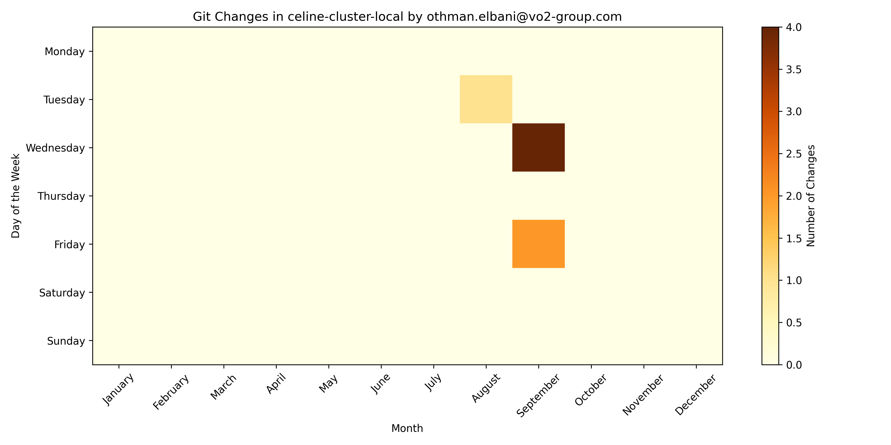  
*Contributions to the `local` repository.*

#### 2. Appointments
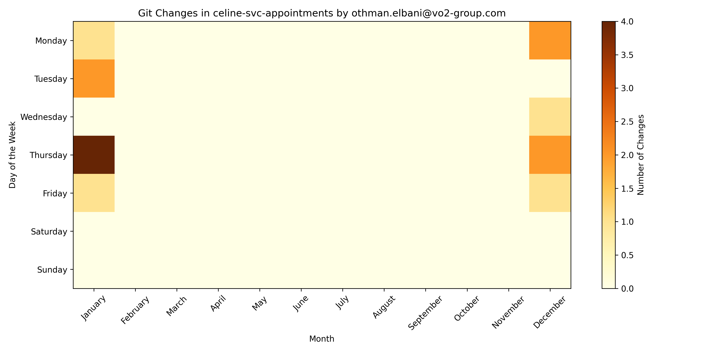  
*Contributions to the `appointments` repository.*

#### 3. Client360
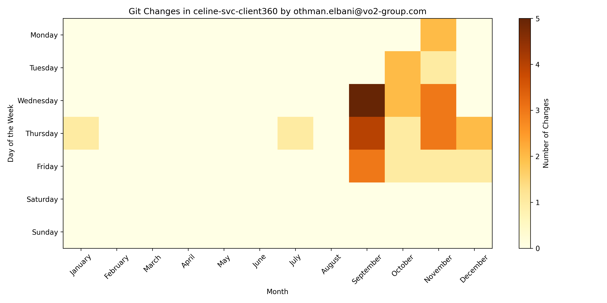  
*Contributions to the `client360` repository.*

#### 4. ClientLists
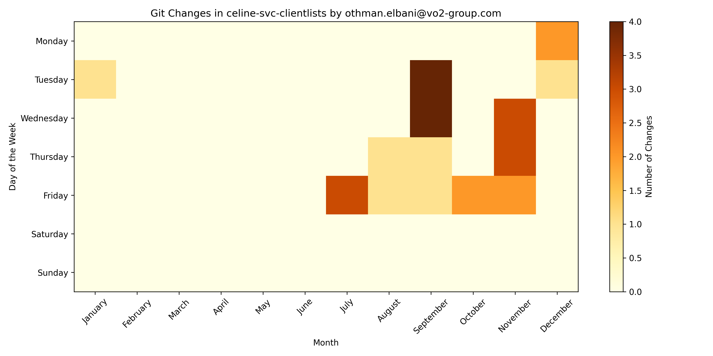  
*Contributions to the `clientlists` repository.*

#### 5. Clients
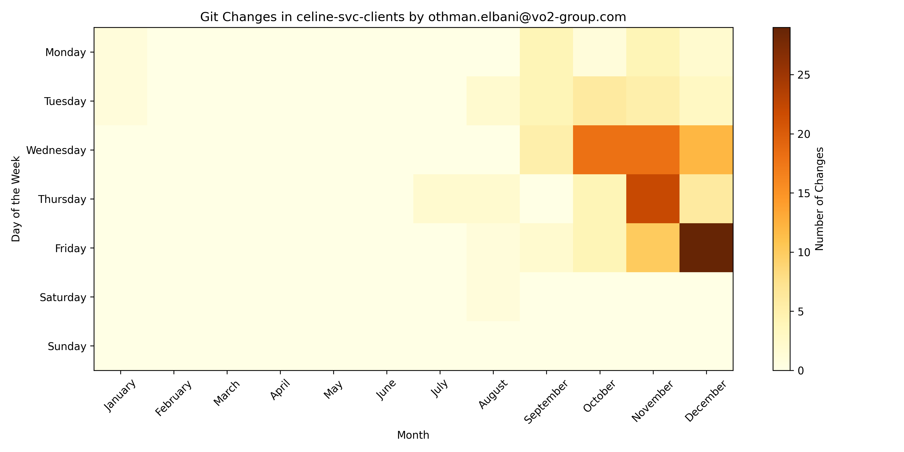  
*Contributions to the `clients` repository.*

#### 6. Curations
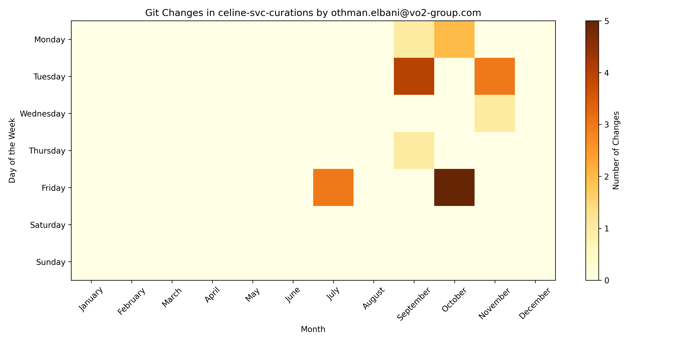  
*Contributions to the `curations` repository.*

#### 7. Outreach
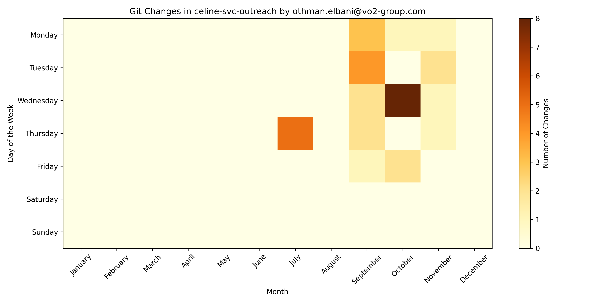  
*Contributions to the `outreach` repository.*

#### 8. Products
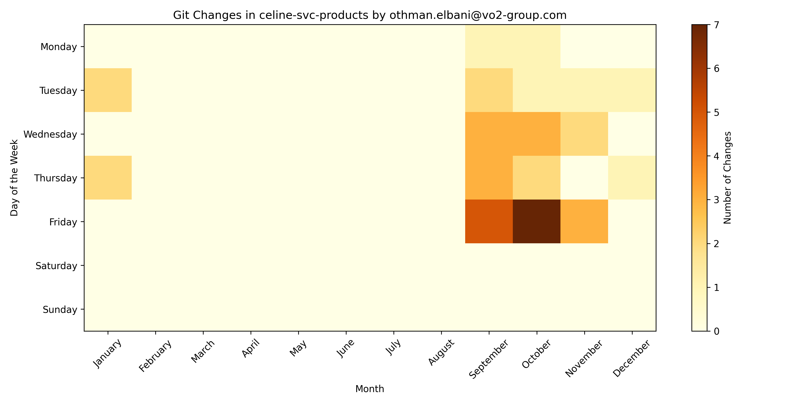  
*Contributions to the `products` repository.*

#### 9. Tasks
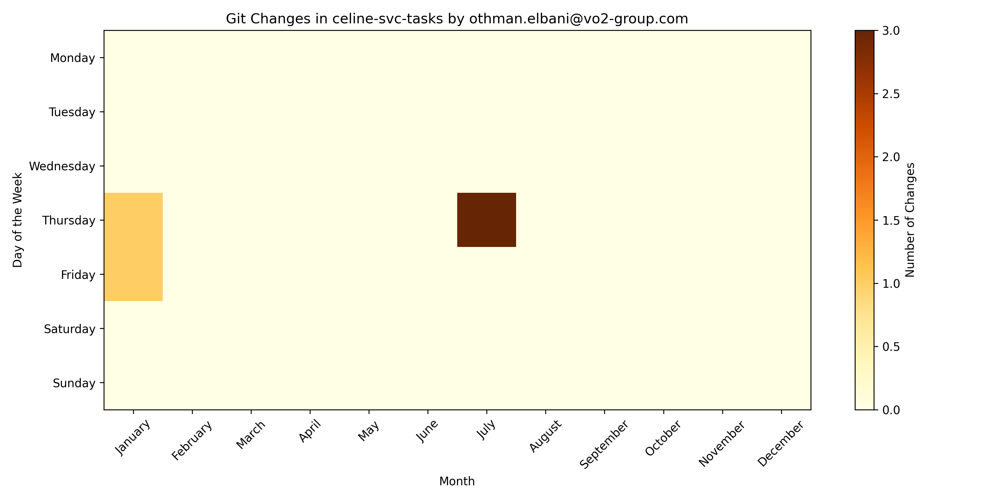  
*Contributions to the `tasks` repository.*

#### 10. Transactions
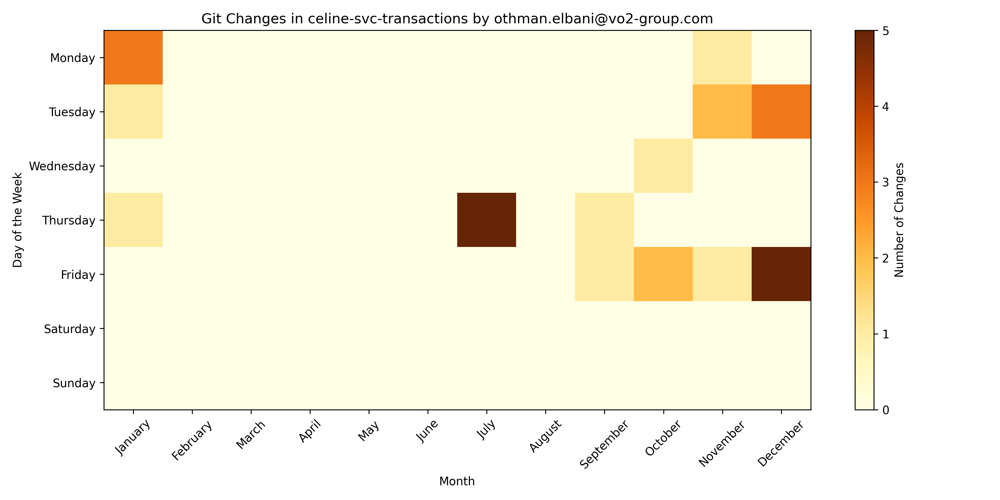  
*Contributions to the `transactions` repository.*

#### 11. Users
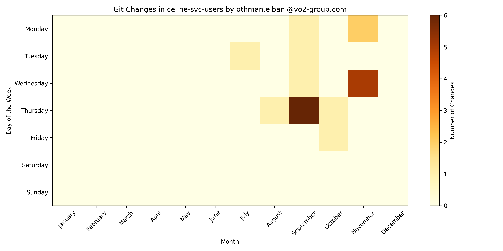  
*Contributions to the `users` repository.*

#### 12. Widgets
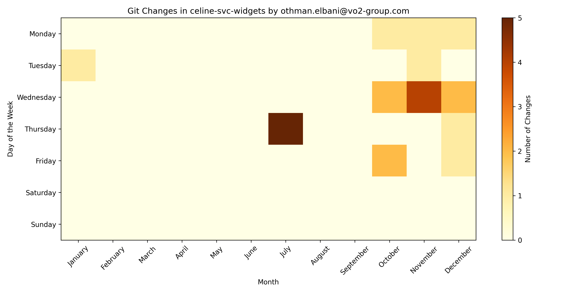  
*Contributions to the `widgets` repository.*

---

### How It Was Made

The charts were generated using a Python script I developed, which automates the process of collecting contribution data from GitHub and visualizing it. The script leverages libraries such as `matplotlib` and `pandas` for data processing and visualization. You can explore the script and its functionality by visiting the [GitHub repository]().

If you have any questions or suggestions, feel free to reach out!